# BTH011 FinalReview

## L00 IP Basics + Routing

### OSI Reference Model

物联网淑慧适用

- Application Layer应用层
- Presentation Layer表示层
- Session Layer会话层
- Transport Layer传输层
- Network Layer L3网络层
- Data Link Layer数据链路层
- Physic Layer物理层
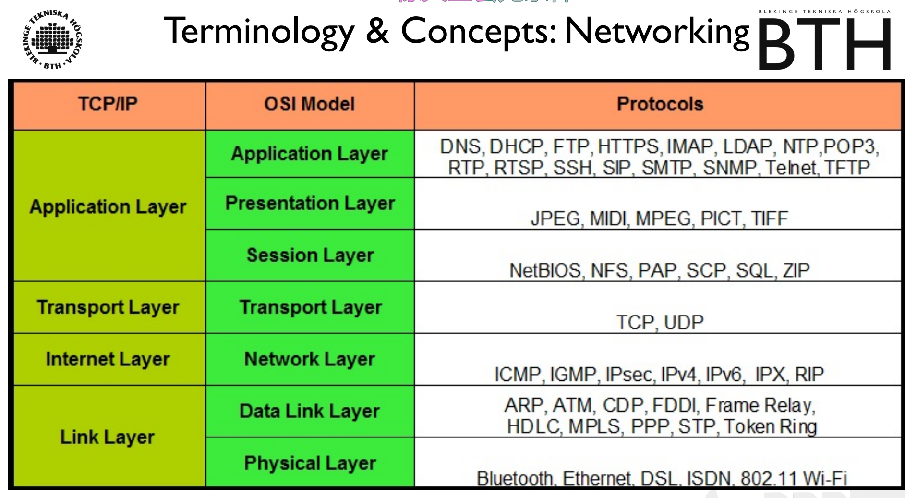

### Host - Device with one or more L3 endpoint

### 网络和传输层和链路层功能
## L02
### IP (Internet Protocol) ipv4ipv6区别子网掩码的划分

- IPv4 32-bit  4*8bit，每位小于等于255（2^9-1）
- IPv6 128-bit 8*16bit  每位小于等于(2^17-1)
- Unreliable and connectionless datagram delivery service
- 不可靠和无连接的数据报传递服务
- IP datagram header
- 数据报报头

### Subnet mask
Address + subnet mask => net ID & host id

- A & MASK => NetID
- A &!MASK => HostID
- 根据位数判断
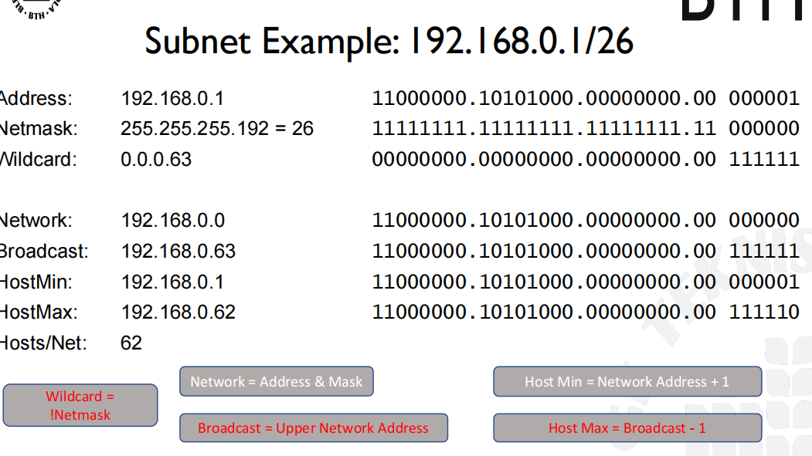
### ARP (Address Resolution Protocol)
- Translate between Network and L2 address
- IP --> MAC
- 查询自己的ARP 缓存，如果在缓存中找到 MAC 地址，设备可以直接将数据发送到该 MAC 地址。
- 否则广播寻找对应mac地址，找到了返回给自己，发送消息并缓存在arp表格

### Router - Device with two or more L3 endpoints within two or more different subnets
### Routing protocols??

## L02 Introduction to Sockets

### ICMP (Internet Control Message Protocol) - Error Handling用于报错

### UDP (User Datagram Protocol)

- Message Oriented Transport Protocol面向消息
- Unreliable datagram delivery不可靠
- Can provide Integrity Verification (Checksum)校验和，完整性验证
- Simple简单
- Statless无状态

### TCP (Transmission Control Protocol)

- Reliable, ordered and error-checked delivery of a stream of bytes
- End-to-end端对端
- Full-duplex全双工，可同时接受与传输信息
#### TCP Protocol Operation
- Connection Establishment建立连接
-- Three way handshake三次握手 同步，同步确认，确认确认
- Data Transfer数据传输
- Connection Termination终止连接也是三次握手，由客户端发起

### Bits, Bytes and Words

- Bit = Binary digit = 0 or 1
- Byte = a sequence of 8 bits = 00000000, 00000001, ..., or 11111111
- Word = a sequence of N bits where N = 16, 32, 64 depending on the 
computer
### ntohs, ntohl, htons, htonl
net（抽象的） to host 
/* Host to Network short||long */

uint16_t htons(uint16_t host16bitvalue);

uint32_t htonl(uint32_t host16bitvalue);

/* Network to Host short||long */

uint16_t ntohs(uint16_t net16bitvalue);

uint32_t ntohl(uint32_t net16bitvalue);
### POSIX (Portable Operating System Interface) - System API Standard

### API - socket(int family, int type, int protocol)

Return: A non-negative integer, a socket descriptor

- UDP sendto recvfrom

s=socket(AF_INET, SOCK_DGRAM, IPPROTO_UDP)

s=socket(AF_INET, SOCK_DGRAM, 0)

- TCP connect send recv

s=socket(AF_INET, SOCK_STREAM, IPPROTO_TCP))

s=socket(AF_INET, SOCK_STREAM, 0)

### API - bind(int socked, struct sockaddr*, int socklen_t)

#include <string.h>
/* ANSI C */ 
void *memset(void *dest, int c, size_t len);填充

void *memcpy(void *dest, const void *src, size_t nbytes);复制

int memcmp(const void *ptr1, const void *ptr2, size_t nbytes);比较

#include <arpa/inet.h>

### /* Convert ’A.B.C.D’ to 32-bit */

int inet_aton(const char *strptr, struct in_addr *addptr);  

### /* Convert ’A.B.C.D’ to 32-bit */

in_addr_t inet_addr(const char *strptr);

### /* Convert 32-bit to ’A.B.C.D’ */

char *inet_ntoa(struct in_addr inaddr);

### /* Convert ’A.B.C.D’ || ’A::D’ to 32/128-bit */

int inet_pton(int family, const char *strptr, void *addptr);  

### /* Convert 32/128-bit to ’A.B.C.D’ ||’A::D’ */

Const char *inet_ntop(int family, const struct *addrptr, char *strptr, size_t len);

## L02 UDP Sockets

### 

### Send a Message with UDP

ssize_t send(int sockfd, const void *buf, size_t len, int flags);

ssize_t sendto(int sockfd, const void *buf, size_t len, int flags,
               const struct sockaddr *dest_addr, socklen_t addrlen);

ssize_t sendmsg(int sockfd, const struct msghdr *msg, int flags);

ssize_t write(int fd, const void *buf, size_t count);

### Receive a Message with UDP

ssize_t recv(int sockfd, void *buf, size_t len, int flags);

ssize_t recvfrom(int sockfd, void *buf, size_t len, int flags,
                 struct sockaddr *src_addr, socklen_t *addrlen);

ssize_t recvmsg(int sockfd, struct msghdr *msg, int flags);

ssize_t read(int fd, void *buf, size_t count);

### API - getaddrinfo(const char *hostname, const char *service, const struct addrinfo *hints, struct addrinfo **result)解析地址

### Connect on UDP

- Kernel checks for errors, records IP and port of the peer (from sockaddr). 
- Cannot use sendto -> send or write
- Cannot use recvfrom -> recv or read
- Asyncronous errors are returned to the process 

## L03 TCP Sockets图

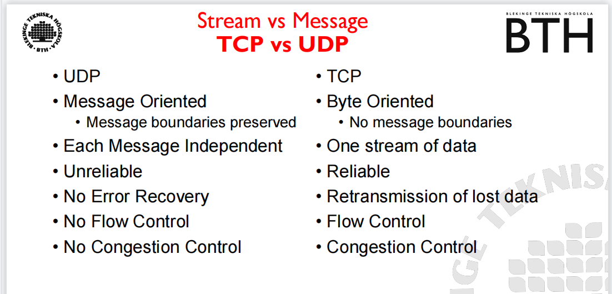
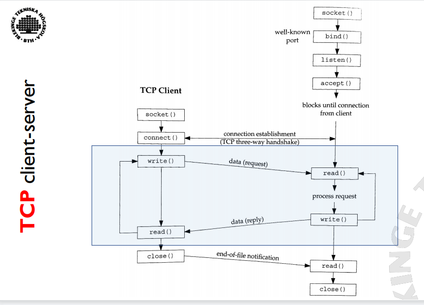

### API - connect(int sockfd, const struct sockaddr *addr, socklen_t addrlen)

- Return: int
- Initialize a TCP connection towards the destination in addr

### API - bind(int sockfd, const struct sockaddr *addr, socklen_t addrlen)

- Assigns a local address and port to a socket

### API - listen(int sockfd, int backlog)

- Converts an active socket into a passive one
- Backlog specifies max number of connections to queue
  - Completed connection queue (ESTABLISHED)
  - Incomplete connection queue (SYN_RCVD)

### API - accept(int sockfd, const struct sockaddr *addr, socklen_t addrlen)

### API - close(int sockfd)

int getsockname(int sockfd, struct sockaddr *localaddr, socklen_t *localaddrlen); 
int getpeername(int sockfd, struct sockaddr *peeraddr, socklen_t *peerlen); 
### close和shutdown的区别
- close() terminates data transfer in both directions
- shutdown() selectively terminates data transfer in one direction or both directions
### Signal Disposition / Action
Every signal has a disposition, or action associated with 
the signal. Set by SigAction. 

- Function, catch the signal. 

SIGKILL/SIGSTOP cant be caught
Called with an integer argument
 
- Ignore

SIGKILL/SIGSTOP can‘t be ignored

- Default, normally reception of any signal is to 
terminate process.
## L04 IO Models

### IO Multiplexing

### IO Models

- Blocking I/O 阻塞recvfrom
- 在阻塞 I/O 模型中，当发起 I/O 操作时，调用进程将被阻塞，直到操作完成。该过程一直等到请求的数据可用或操作完成。
-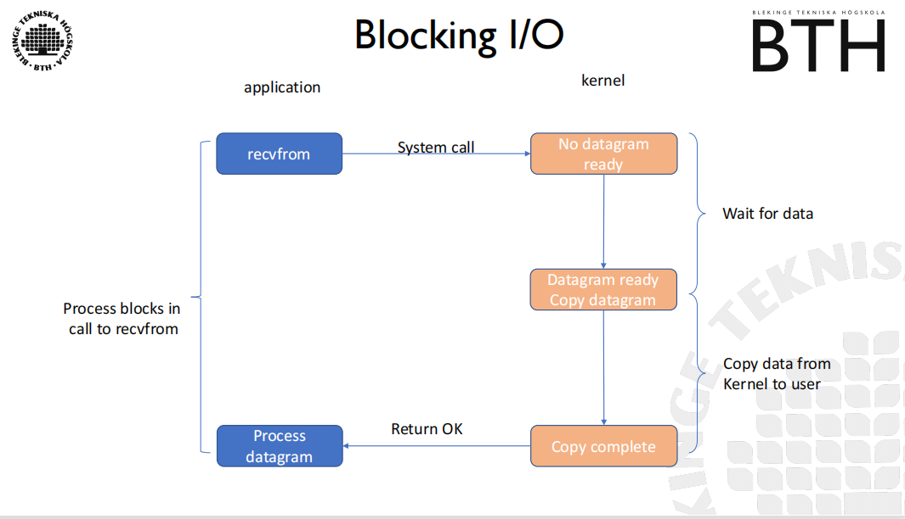
- Nonblocking I/O 不阻塞recvfrom 若数据没有准备好则返回EWOULDBLOCK
- 非阻塞 I/O 允许进程启动 I/O 操作并继续执行，而无需等待操作完成。它立即返回，进程可以在定期检查操作状态的同时执行其他任务。此模型支持并发，但需要频繁轮询，这可能效率低下。
- 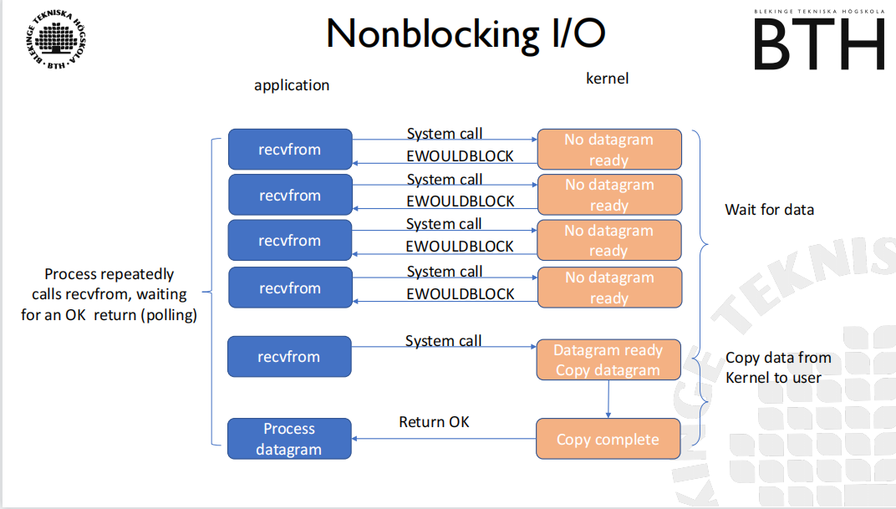
- I/O multiplexing (select and poll) 用一个select线程集中处理轮询
- I/O 多路复用允许进程使用单个系统调用同时监视多个 I/O 源。该进程可以阻塞 I/O 多路复用调用，并在任何受监视的 I/O 源准备好读取或写入时收到通知。
- 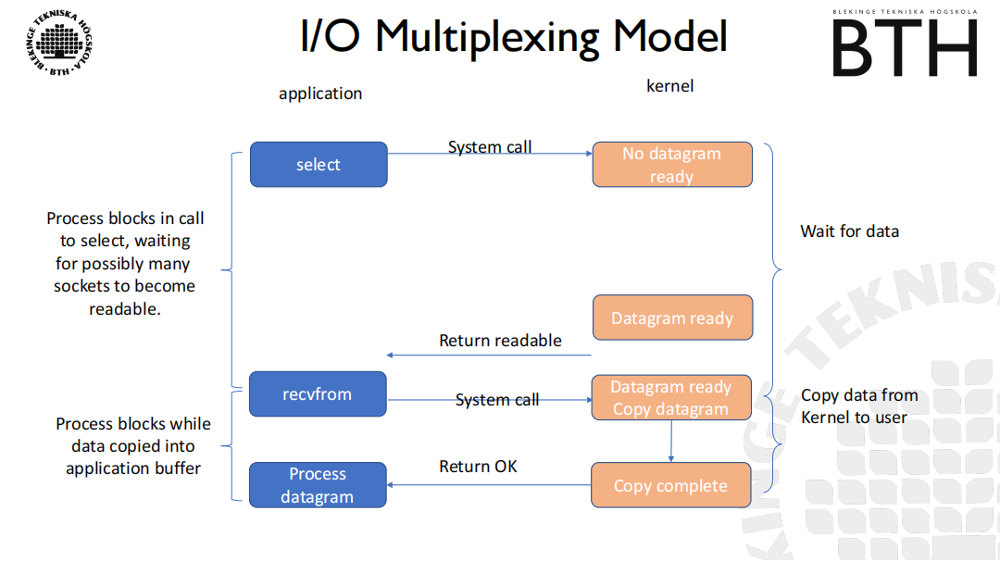
- Signal driven (SIGIO) 数据准备完成后以信号通知用户进程
- 在信号驱动的 I/O 模型中，进程为特定的 I/O 事件设置信号处理程序。当事件发生时，内核向进程发送信号，并调用信号处理程序。该模型允许进程执行其他任务，直到它收到表明 I/O 操作已准备就绪的信号。
- 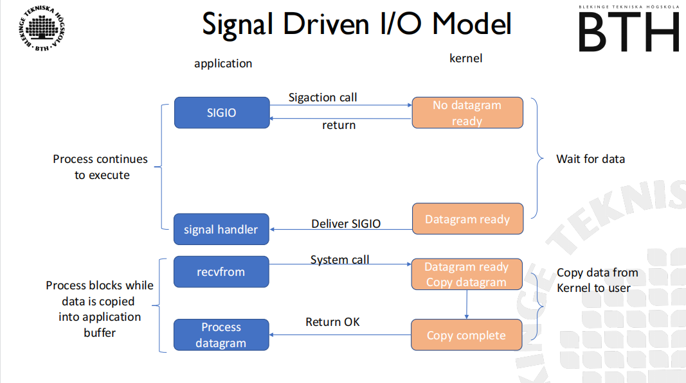
- Asynchronous I/O (POSIX aio_ functions) 异步处理
- 异步 I/O 允许进程发起 I/O 操作并继续执行而无需等待。该流程提供了一个回调函数，该函数将在操作完成时调用。该模型提供了最大的并发性并避免了显式轮询的需要。
- 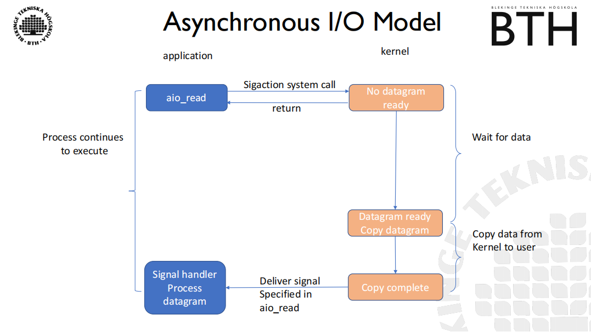

### What does 'Ready' mean?

- Socket is ready for READING if:
  - Number of bytes in socket receive buffer is larger than low-water mark
  - The read half is closed (a socket receive FIN)
  - It's a listening socket, at least ONE completed connections (accept() would not block)
  - A socket error is pending
- Socket is ready for WRITING if:
  - Number of bytes available space in socket send buffer is larger than low-water mark for both connected TCP or UDP.
  - The write half is closed (a socket send FIN)
  - A socket using non-blocking connect has completed the connection, or the connect has failed. i.e. after connect()
  - A socket error is pending

### Socket timeout

1. Alarm (SIGALRM)  + Signal handler 
2. Select
3. SO_RCVTIMEO, SO_SNDTIMEO - setsockopt()

### DNS的作用和功能
Translates / maps between strings and IP addresses

1. Forward lookup:
www.example.com -> 192.0.2.44

2. Reverse lookup:
192.0.2.44 -> www.example.com

### getaddrinfo函数的功能(三个转换)
- IPv4 & IPv6
- Name-to-address
- Service-to-port 

### getnameinfo函数的功能
- IPv4 & IPv6
- Address-to-name
- Port-to-Service 

## L06 Multicast
### 函数读写的区别图
- 
### Multicast address

- IPv4
  - Class D; 224.0.0.0 - 239.255.255.255
- IPv6
  - ff:[*]
- Special
  - 224.0.0.1 all-hosts
  - 224.0.0.2 all-routers
  - ff01::1, ff02::1 all-nodes
  - ff01::2, ff02::2, ff05::2 all-routers

## HTTP

### HyperText Transfer Protocol

- HTTP is an asymmetric request-response client-server protocol
- Stateless
- Permits negotiation of data type and representation

### URL (Uniform Resource Locator)

protocol://hostname:port/path-and-file-name
- 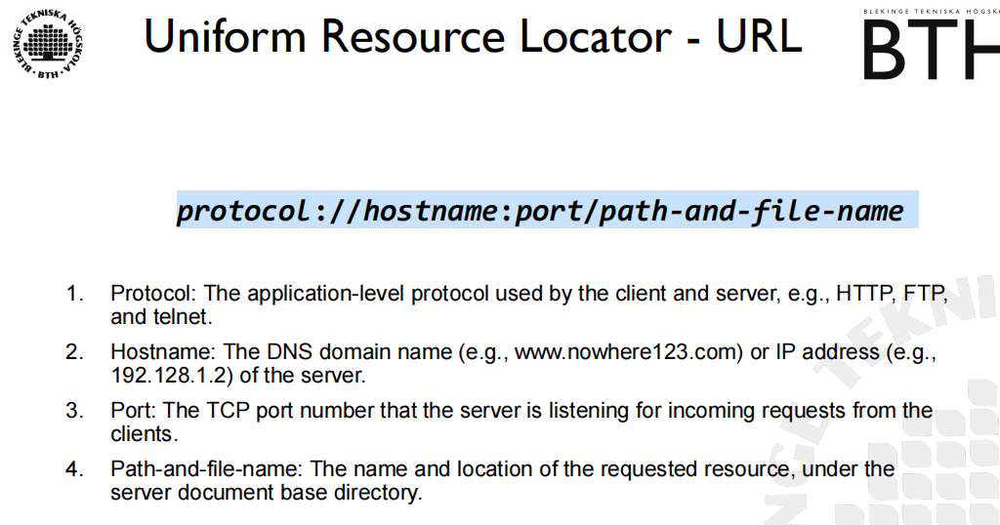
### HTTP 的方法任意五个及其功能

- 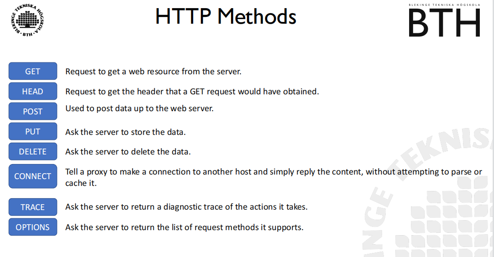
## Basic Network Cryptography

### Security Attacks

- Passive Attacks
  - Learn or make use of information from target system but does not affect system resources.
- Active Attacks
  - Attempts to alter system resources or affect their operations.

### Terminology

- Plaintext - The original message or data that is fed into the algorithm as input
- Encrption algorithm - The encryption algorithm performs various operations on the plaintext
- Secret key - Input to the encryption algorithm that governs the operations.
- Ciphertext - The scrambled message.
- Decryption Algorithm - The decryption algorithm deciphers the ciphertext, using the secret key, and produces the original data.

### Symmetric Encryption对称

- Security - Depends on the secrecy of the key
- Algorithms
  - Data Encryption Standard (DES), 3DES
  - Blowfish
  - Twofish
  - Advanced Encryption Standard (AES)
### Public Key/Asymmetric Encryption非对称
### 非对称加密的六个组成部分
- 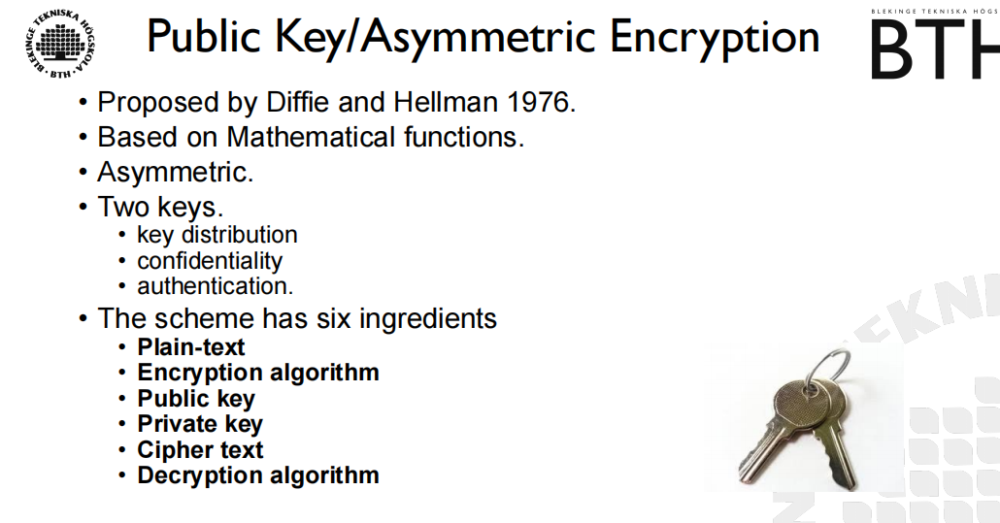
### Applications of Asymmetric Encryption
- Encryption/decryption: 
The sender encrypts a message with the recipient’s public key
- Digital signature: 
The sender ”signs” a message with its private key
- Encryption/decryption: 
The sender encrypts a message with the recipient’s public key
# SSL-TLS-and-HTTPS
- First Step Fragmentation: Each upper layer message is fragmented into block of 214 bytes (16384 bytes) or less 
- Second Step Compression: Optional step, must be lossless and may not increase the length by more than 1024 bytes 
- Third Step Message Authentication Code (MAC): shared secret key is used to compute MAC 
- Fourth Step Encryption: compressed message (if applied) and MAC are encrypted using symmetric encryption 
- Final Step Header Preparation.
# Client-Server Design Alternatives

### Server Strategies

- Iterative server
- Concurrent server, one fork per client request
- Prefork, each child calls accept
- Prefork, file locking to protect accept
- Prefork, thread mutex to protect accept
- Prefork, with parent passing socket to child
- Concurrent server, one thread per client.
- Prethreaded with mutex to protect accept
- Prethreaded with main thread calling accept

