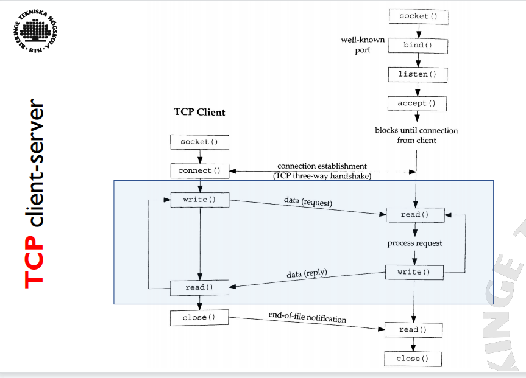

##L00
###各层的协议
物联网淑慧适用

- Application Layer应用层
- Presentation Layer表示层
- Session Layer会话层
- Transport Layer传输层
- Network Layer L3网络层
- Data Link Layer数据链路层
- Physic Layer物理层

###网络和传输层和链路层功能

##L02
###ipv4ipv6区别子网掩码的划分
- IPv4 32-bit  4*8bit，每位小于等于255（2^9-1）
- IPv6 128-bit 8*16bit  每位小于等于(2^17-1)
- Unreliable and connectionless datagram delivery service
- 不可靠和无连接的数据报传递服务
- IP datagram header
- 数据报报头

###subnetmask的计算
Address + subnet mask => net ID & host id

- A & MASK => NetID
- A &!MASK => HostID
- 根据位数判断

###ARP的功能

- Translate between Network and L2 address
- IP --> MAC
- 查询自己的ARP 缓存，如果在缓存中找到 MAC 地址，设备可以直接将数据发送到该 MAC 地址。
- 否则广播寻找对应mac地址，找到了返回给自己，发送消息并缓存在arp表格
##L03
### ICMP (Internet Control Message Protocol) - Error Handling用于报错

###UDPsocket和TCPsocket的图 10分

###UDP读写函数的区别
###TCP UDP的特点区别至少三点

###三次握手 四次挥手的图
###函数的作用
###close和shutdown的区别

###POSIX信号处理(三种处理方式)
Every signal has a disposition, or action associated with 
the signal. Set by SigAction. 

- Function, catch the signal. 

SIGKILL/SIGSTOP cant be caught
Called with an integer argument
 
- Ignore

SIGKILL/SIGSTOP can‘t be ignored

- Default, normally reception of any signal is to 
terminate process.
###POSIX的异常

##L06
##五种I/O模型和图像的掌握
### IO Multiplexing

### IO Models

- Blocking I/O 阻塞recvfrom
- 在阻塞 I/O 模型中，当发起 I/O 操作时，调用进程将被阻塞，直到操作完成。该过程一直等到请求的数据可用或操作完成。
-
- Nonblocking I/O 不阻塞recvfrom 若数据没有准备好则返回EWOULDBLOCK
- 非阻塞 I/O 允许进程启动 I/O 操作并继续执行，而无需等待操作完成。它立即返回，进程可以在定期检查操作状态的同时执行其他任务。此模型支持并发，但需要频繁轮询，这可能效率低下。
- 
- I/O multiplexing (select and poll) 用一个select线程集中处理轮询
- I/O 多路复用允许进程使用单个系统调用同时监视多个 I/O 源。该进程可以阻塞 I/O 多路复用调用，并在任何受监视的 I/O 源准备好读取或写入时收到通知。
- 
- Signal driven (SIGIO) 数据准备完成后以信号通知用户进程
- 在信号驱动的 I/O 模型中，进程为特定的 I/O 事件设置信号处理程序。当事件发生时，内核向进程发送信号，并调用信号处理程序。该模型允许进程执行其他任务，直到它收到表明 I/O 操作已准备就绪的信号。
- 
- Asynchronous I/O (POSIX aio_ functions) 异步处理
- 异步 I/O 允许进程发起 I/O 操作并继续执行而无需等待。该流程提供了一个回调函数，该函数将在操作完成时调用。该模型提供了最大的并发性并避免了显式轮询的需要。
- 

###五种模型的对比图

###DNS的作用和功能
Translates / maps between strings and IP addresses

1. Forward lookup:
www.example.com -> 192.0.2.44

2. Reverse lookup:
192.0.2.44 -> www.example.com
###getaddrinfo函数的功能(三个转换)
- IPv4 & IPv6
- Name-to-address
- Service-to-port 
###getnameinfo函数的功能
- IPv4 & IPv6
- Address-to-name
- Port-to-Service 
##L07
###函数读写的区别图
- 
###multicast address的ipv4和ipv6

- IPv4
  - Class D; 224.0.0.0 - 239.255.255.255
- IPv6
  - ff:[*]
- Special
  - 224.0.0.1 all-hosts
  - 224.0.0.2 all-routers
  - ff01::1, ff02::1 all-nodes
  - ff01::2, ff02::2, ff05::2 all-routers

###HTTP结构过程协议响应
###HTTP的方法任意五个及其功能
- 
###网络安全

- Passive Attacks
  - Learn or make use of information from target system but does not affect system resources.
- Active Attacks
  - Attempts to alter system resources or affect their operations.
##对称加密非对称加密密钥
### Symmetric Encryption对称

- Security - Depends on the secrecy of the key
- Algorithms
  - Data Encryption Standard (DES), 3DES
  - Blowfish
  - Twofish
  - Advanced Encryption Standard (AES)

###对称加密的六个组成部分
- 
###对称加密的应用
- Encryption/decryption: 
The sender encrypts a message with the recipient’s public key
- Digital signature: 
The sender ”signs” a message with its private key
- Encryption/decryption: 
The sender encrypts a message with the recipient’s public key